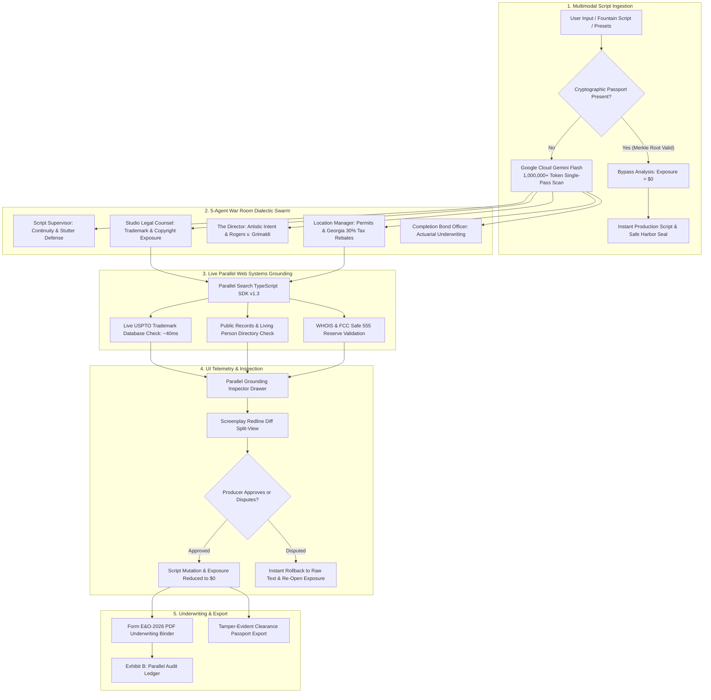

# DeepClear Studio — Technical Architecture & Data Flow

## 1. High-Level System Architecture Diagram

---

## 2. Core Architectural Principles
1. **Zero-Drop Resilience**: Self-Healing Model Cascade across Gemini models (`gemini-flash-latest`, `gemini-3.5-flash`, `gemini-3.7-flash`) with in-flight session resumption.
2. **Deterministic Grounding**: Every proposed narrative substitution is anchored by live Parallel Web Search USPTO verification.
3. **Producer Sovereignty**: 1-click dispute triggers ensure human creators retain ultimate veto power over automated mutations.
4. **Client-Side Privacy**: Full session state and chat histories persist exclusively in the user's browser via `localStorage`.
