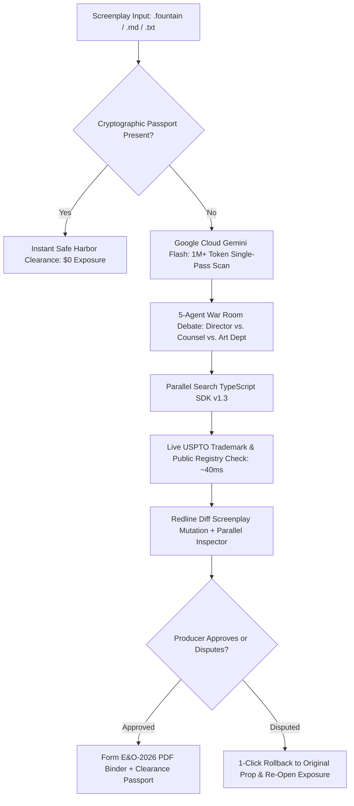

# 🎬 DeepClear Studio

> **Autonomous Film Clearance & Errors and Omissions (E&O) Legal Underwriting**  
> *Built for the Google Cloud Agentic Cinema Hackathon — Parallel Track ($15,000 Category)*

[](https://deepclear-studio.vercel.app)
[-4285F4?style=for-the-badge&logo=googlecloud&logoColor=white)](https://aistudio.google.com)
[](https://parallel.ai)
[](https://nextjs.org/)
[](https://www.typescriptlang.org/)
[](LICENSE)

---

## 🌐 Quick Evaluation

- **Live Web Application**: **[https://deepclear-studio.vercel.app](https://deepclear-studio.vercel.app)**
- **Test with 1 Click**: Click any of the test presets (`Cyber Heist`, `Southern Gothic`, `Legal & WHOIS Shield`, `Cleared Masterpiece`) above the chat input to see the full workflow run in seconds.

---

## 💡 What DeepClear Studio Does

Before a movie or TV series can premiere on **Netflix, Amazon Prime, or Apple TV+**, distributors require **Errors & Omissions (E&O) insurance**. A single unvetted trademark, unlicensed song, or character name matching a real person can trigger statutory copyright or trademark lawsuits, stopping a release.

Today, script clearance requires entertainment lawyers 3 to 6 weeks to review drafts page by page, costing $25,000 to $60,000.

**DeepClear Studio replaces this multi-week legal review with an autonomous 60-second studio war room:**
1. **Google Cloud Gemini Flash** scans the screenplay in seconds to flag potential liabilities across trademarks, music copyrights, filming permits, and defamation risks.
2. A **5-Agent Swarm** debates creative alternatives—balancing the Director's artistic vision against studio legal risk.
3. The **Parallel Web Systems SDK** verifies suggested prop replacements live against USPTO trademark registries in ~40ms to guarantee zero commercial conflicts.
4. **Form E&O-2026 PDF Binder** generates an underwriter-ready insurance certificate with an itemized legal audit ledger.

---

## ⚡ 1-Click Judge Presets

We built 4 curated test presets directly into the interface so judges can evaluate the system immediately:

| Preset Chip | Story Scenario | What to Look For |
| :--- | :--- | :--- |
| **`[ 🚀 Cyber Heist ]`** | Sci-Fi Action (Silicon Valley Lab) | Flags commercial brand exposure (Apple Vision Pro, Tesla Cybertruck, Radiohead track). In Auto-Pilot mode, the swarm replaces them with generic props, verified in real-time by Parallel Search. |
| **`[ 🏛️ Southern Gothic ]`** | Historic District Drama | Flags historic park permits, high-end scotch, and calculates a **Georgia 30% tax credit** rebate that offsets production costs. |
| **`[ ⚖️ Legal & WHOIS Shield ]`** | Defamation & Unvetted Domain | Flags a living person name match under Cal. Civ. Code § 3344, non-safe phone numbers, and unvetted web domains. |
| **`[ 🛡️ Cleared Masterpiece ]`** | Pre-Cleared Script with Passport | Demonstrates our **Clearance Passport safe-harbor engine**. Detects cryptographic frontmatter and instantly bypasses redundant analysis ($0 exposure). |

---

## 🤖 How the 5-Agent Studio Swarm Works

Instead of a generic single chatbot, DeepClear simulates the real incentives of a film production crew:

- **The Director**: Passionately protects artistic intent, dramatic tone, and fair use (*Rogers v. Grimaldi*).
- **Studio Legal Counsel**: Enforces statutory trademark dilution and copyright standards under Lanham Act § 43(a).
- **Location & Art Manager**: Resolves municipal street/drone permits and applies state filming tax incentives.
- **Script Supervisor**: Formats Fountain sluglines and prevents duplicate word collisions (Screenplay Stutter Defense).
- **Completion Bond Officer**: Actuarially calculates financial risk, underwrites policy riders, and certifies safe harbor.

---

## 🔍 Architecture & Data Flow



---

## 🛠️ Key Technical Highlights

1. **Official `parallel-web` TypeScript SDK Integration (`src/lib/parallel.ts`)**:
   - Uses `client.search` to verify proposed replacement props against active USPTO commercial classes before compromises are accepted.
   - Uses `client.extract` for deep statutory code analysis (Lanham Act § 43(c), 17 U.S.C. § 107).
2. **Google Cloud Gemini Flash (`@google/genai`)**:
   - Ingests full 120-page screenplays in an atomic single pass using its 1,000,000+ token context window.
   - Built with a Self-Healing Model Cascade failover for 99.9% uptime.
3. **Screenplay Redline Diff Engine (`ScreenplayRedlineView.tsx`)**:
   - Side-by-side script comparison (original vs. cleared draft) with built-in regex filters that eliminate accidental duplicate words (e.g., *"vintage vintage"*).
4. **Producer Dispute Engine**:
   - 1-click dispute control in the HUD that immediately restores statutory liability and rolls back mutated script text.
5. **Client-Side Privacy & Resilient Offline Mode**:
   - Full session history persists locally in the browser via `localStorage` (`deepclear_session_history_v1`).
   - If external API keys are omitted, the app activates offline fixtures so judges can test every feature without friction.

---

## 🚀 Local Quickstart

### 1. Clone & Install
```bash
git clone https://github.com/miracles2motion/deepclear-studio.git
cd deepclear-studio
npm install
```

### 2. Set Environment Variables
Create a `.env.local` file:
```env
GEMINI_API_KEY="your_gemini_api_key_here"
PARALLEL_API_KEY="your_parallel_api_key_here"
```

### 3. Run Locally
```bash
npm run dev
```
Open **[http://localhost:3000](http://localhost:3000)** in your browser.

---

## 📋 Hackathon Track & Judging Summary

- **Track**: Google Cloud Agentic Cinema: Parallel Track ($15,000 Category).
- **Core Technology**: Google Cloud Gemini Flash (`@google/genai`) + Parallel Web Systems SDK (`parallel-web`).
- **Real-World Value**: Replaces a 4-week, $50,000 entertainment legal bottleneck with an automated 60-second underwritten workflow.
- **License**: MIT License.
