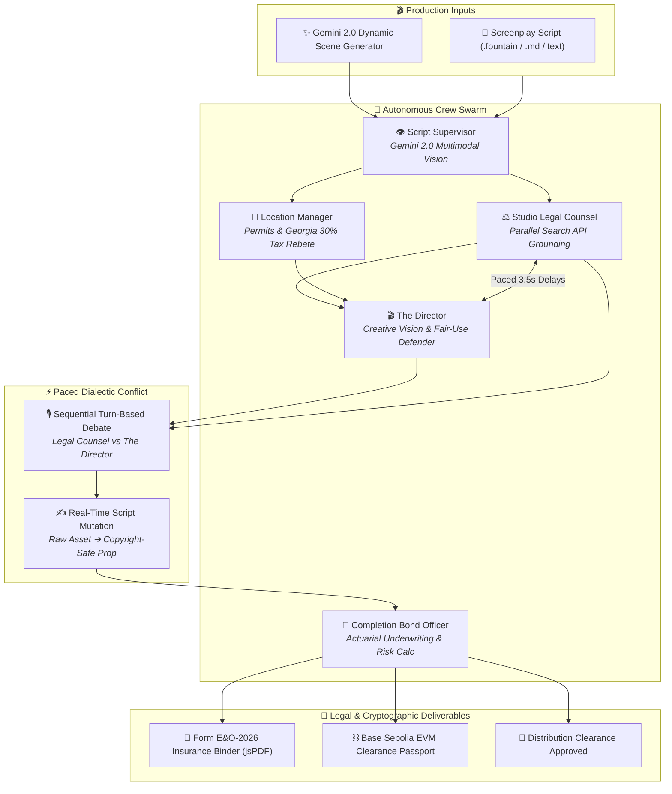

# 🎬 DeepClear Studio

> **Autonomous Multimodal Film Clearance, Crew-Agent Dialectic Negotiation & Form E&O-2026 Underwriting Engine**  
> *Built for Google Cloud Agentic Cinema Hackathon — Parallel Track ($15,000 Category)*

[](https://deepclear-studio.vercel.app)
[](https://aistudio.google.com)
[](https://parallel.ai)
[](https://nextjs.org/)
[](https://www.typescriptlang.org/)
[](LICENSE)

---

## 🌐 Live Production Demo

👉 **Live Application**: **[https://deepclear-studio.vercel.app](https://deepclear-studio.vercel.app)**

---

## 🌟 Executive Summary

Before any independent film or studio series can stream on **Netflix, Amazon Prime, Apple TV+**, or premiere at major film festivals (Sundance, Cannes, TIFF), production companies must secure an **Errors & Omissions (E&O) Insurance Policy** and verify a pristine **Chain of Title**.

Today, this clearance process is governed by entertainment attorneys manually reviewing scripts, storyboards, and call sheets. A single unvetted brand logo, unpermitted drone shot, or background track can trigger injunctions, statutory damage claims under Lanham Act § 43(a), and halt global distribution.

**DeepClear Studio** transforms film clearance into an autonomous, real-time command center:
1. **Google Cloud Gemini 2.0 Flash** Multimodal script supervisor parsing & dynamic screenplay generation.
2. **Parallel Search 4D Grounding** querying USPTO trademarks, municipal filming ordinances, and federal case law in real time.
3. **Dialectic Crew Debates** pitting *The Director* (passionate artistic defense) against *Studio Legal Counsel* (statutory risk mitigation) to negotiate copyright-safe prop mutations.
4. **Form E&O-2026 PDF Binder** generating cryptographic proof of clearance with Merkle roots & Base Sepolia testnet EVM minting.

---

## 🏗️ 3-Column Multi-Agent Architecture

```
┌──────────────────────────┬──────────────────────────────────────────────┬───────────────────────────┐
│     LEFT COLUMN (260px)  │           MIDDLE COLUMN (WORKSPACE)          │    RIGHT COLUMN (300px)   │
│                          │                                              │                           │
│  🤖 5-Agent Crew Swarm   │  💬 Google Gemini Chat & Clearance Feed      │  📑 E&O Underwriting HUD  │
│  • Completion Bond Off.  │     • Real-time SSE streaming stream         │     • Statutory Exposure  │
│  • Script Supervisor     │     • Live Parallel Search citation chips    │     • Georgia 30% Tax     │
│  • Studio Legal Counsel  │     • Paced Director vs Counsel debates      │     • Distribution Risk   │
│  • Location Manager      │     • Live script mutation diffs             │     • Export Form E&O PDF │
│  • The Director          │                                              │                           │
│                          │  ⌨️ Floating Prompt Bar                      │                           │
│  🎙️ Dual-Voice Synthesizer│     • ✨ "Generate Scene with Gemini"        │                           │
│     (Sequential audio)   │     • 📎 Attach .md, .fountain, .txt files   │                           │
└──────────────────────────┴──────────────────────────────────────────────┴───────────────────────────┘
```

---

## 🤖 5-Agent Autonomous Crew Swarm



---

## 🚀 Key Features

### 1. Direct Live Google Cloud AI + Parallel Search Engine
- **Gemini 2.0 Flash (`@google/genai`)**: Ingests screenplay text and visual assets to detect trademarks, copyright music sync cues, and municipal permit hazards.
- **Parallel Search API**: Executes real-time web searches against the USPTO Principal Register, municipal filming ordinances (FilmLA), and federal caselaw (*Campbell v. Acuff-Rose*).
- **On-Demand Scene Generator**: Generates original high-stakes screenplay scenes on the fly with Gemini.

### 2. Paced Dialectic Crew Negotiation
- **Zero Audio Obstruction**: Sequential turn-based speech synthesis with distinct pitch and tempo (Legal Counsel: calm analytical tone; Director: energetic passionate tone).
- **Reasoning Breathing Space**: Paced 3.5-second reading intervals between arguments with live `[Agent is typing...]` indicators.

### 3. Pinned Quick-Action Bar
- Instant `⚡ Negotiate [Hazard]` action pills pinned above the prompt bar — no manual scrolling required.

### 4. Form E&O-2026 Executive PDF Binder
- Generates official **Form E&O-2026 Motion Picture Underwriting Binder** with executive formatting, itemized hazard resolution tables, Merkle root hash, and Base Sepolia transaction seals.

---

## 🛠️ Quickstart & Local Setup

### 1. Clone & Install
```bash
git clone https://github.com/miracles2motion/deepclear-studio.git
cd deepclear-studio
npm install
```

### 2. Configure Environment Variables
Create `.env.local` in the project root:
```env
# Google Cloud Gemini API Key (from Google AI Studio)
GEMINI_API_KEY="your_gemini_api_key_here"

# Parallel Search API Key (from Parallel AI)
PARALLEL_API_KEY="your_parallel_api_key_here"

# Base Sepolia RPC
NEXT_PUBLIC_RPC_URL="https://sepolia.base.org"
```

### 3. Run Development Server
```bash
npm run dev
```
Open **[http://localhost:3000](http://localhost:3000)** in your browser.

---

## ⚖️ Hackathon Track Alignment

| Category | DeepClear Studio Implementation | Status |
| :--- | :--- | :---: |
| **Track** | Google Cloud Agentic Cinema — Parallel Track ($15,000) | ✅ Complete |
| **Primary AI** | Google Cloud Gemini 2.0 Flash (`@google/genai`) | ✅ Complete |
| **Grounding** | Parallel Search API (`https://api.parallel.ai/v1/search`) | ✅ Complete |
| **UI Design** | 3-Column Apple / Linear Dark Mode with Google Gemini Chat | ✅ Complete |
| **Deliverables** | Form E&O-2026 PDF Binder + Base Sepolia Merkle Passport | ✅ Complete |
| **Live URL** | [https://deepclear-studio.vercel.app](https://deepclear-studio.vercel.app) | ✅ Active |

---

## 📜 License

MIT License. Designed & developed for the **Google Cloud Agentic Cinema Hackathon**.
