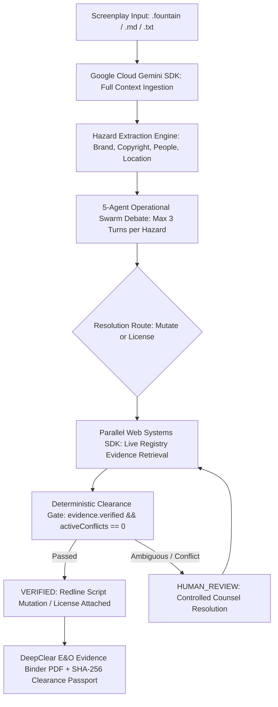

# DeepClear Studio

**The Agentic Clearance Engine for Film & Television**

> *"AI proposes. Evidence decides. Cryptography locks it."*

[](https://nextjs.org/)
[](https://cloud.google.com/vertex-ai)
[](https://parallel.ai)
[](https://www.typescriptlang.org/)
[](https://opensource.org/licenses/MIT)

**Live Demo:** [https://deepclear-studio.vercel.app](https://deepclear-studio.vercel.app)  
**Youtube Demo:** [https://youtu.be/_SuDTFCkzV8](https://youtu.be/_SuDTFCkzV8)

**Hackathon Track:** Google Cloud Agentic Cinema (Parallel Track)

---

## What DeepClear Studio Does

Before a movie or TV series can premiere on major distribution platforms, distributors require comprehensive **Errors & Omissions (E&O) insurance review**. An unvetted commercial trademark, unlicensed music cue, or character collision can jeopardize release schedules.

In traditional pre-production workflows, screenplay clearance involves 15 to 30 business days of manual cross-referencing.

**DeepClear Studio transforms this process into an agentic, evidence-backed preparation engine:**
1. **Google Cloud Gemini SDK** ingests full 120-page screenplays in context (1,000,000+ token context window) to extract potential clearance hazards.
2. A **5-Agent Operational Swarm** deliberates across creative, legal, production, and continuity objectives.
3. The **Parallel Web Systems SDK (`parallel-web`)** retrieves live external evidence from USPTO trademark registries and public records in real time.
4. The **Deterministic Clearance Gate** enforces: *"NO VERIFIED EVIDENCE. NO CLEARANCE."* It evaluates evidence validity and active conflict counts before transitioning any hazard to `VERIFIED`.
5. The client compiles a **DeepClear E&O Evidence Binder PDF** with Exhibit B verification audit trails and an embedded **Cryptographic Clearance Passport (SHA-256 state/history manifest)**.

---

## 1-Click Judge Presets

Curated test presets are built directly into the interface for immediate verification:

| Preset Chip | Story Scenario | What to Look For |
| :--- | :--- | :--- |
| **`[ Cyber Heist ]`** | Sci-Fi Action (Silicon Valley Lab) | Commercial brand exposure (Apple Vision Pro, Tesla Cybertruck, commercial music track). In Auto-Pilot mode, the swarm proposes generic substitutes verified via Parallel Search. |
| **`[ Southern Gothic ]`** | Historic District Drama | Municipal filming permits, historic park rules (FAA Part 107 drone compliance), and independent **Estimated Incentive Eligibility** modeling. |
| **`[ Legal & WHOIS Shield ]`** | Defamation & Unvetted Domain | Living person reference under Cal. Civ. Code § 3344, non-safe phone numbers (defused to NANPA 555-0100..0199), and domain collisions under ACPA. |
| **`[ Executive Impasse ]`** | Contested Mark (90/10 Ratio) | A live trademark registry conflict where the Parallel search returns an active competing registration. The 5-agent swarm debates the hazard but cannot reach an acceptable resolution within the 3-turn bounded debate — hitting a deadlock at Turn 6. Because the agents cannot self-approve a contested mark, the Fail-Closed Clearance Gate blocks verification and escalates to human review. An interactive **Producer Directive** card appears, requiring the producer to make the final call before the workflow can continue. This demonstrates the 90/10 controlled autonomy model: AI handles 90% of the clearance process, but human input is required when evidence is genuinely contested and no safe resolution can be confirmed. |

---

## The 5-Agent Studio Swarm

DeepClear models authentic production crew roles:

- **Script Supervisor (`script_supervisor`)**: Screenplay formatting, sluglines, dialogue cues, and regex stutter defense against duplicate words (`\b([a-zA-Z]+)\s+\1\b`).
- **Studio Legal Counsel (`legal_counsel`)**: Evaluates Lanham Act § 43(a), Title 17 U.S.C. § 504 copyright remedies, and formulates targeted Parallel queries.
- **Location & Art Manager (`location_manager`)**: Resolves municipal permits, drone rules (FAA Part 107), and models independent state tax incentive eligibility (e.g. Georgia 30% QPE).
- **The Director (`director`)**: Protects dramatic stakes, era authenticity, and creative intent (*Rogers v. Grimaldi*); handles producer disputes.
- **Completion Bond Officer (`bond_officer`)**: Evaluates aggregate clearance posture, evidence completeness, and underwriting readiness; recommends binder release.

*Note:* Gemini Extraction Engine is the underlying AI context processor, not one of the five operational agents.

---

## Architecture & Data Flow



---

## Key Technical Highlights

1. **Official `parallel-web` TypeScript SDK Integration (`src/lib/parallel.ts`)**:
   - Uses `client.search` to verify proposed replacement props against active USPTO commercial classes before compromises are accepted.
   - Normalizes external evidence into DeepClear's internal evidence contract.
2. **Google Cloud Gemini Flash (`@google/genai`)**:
   - Ingests full 120-page screenplays in an atomic single pass using its 1,000,000+ token context window.
   - Self-Healing Model Cascade with 7 configured models and dynamic ModelService registry discovery.
3. **Screenplay Redline Diff Engine (`ScreenplayRedlineView.tsx`)**:
   - Sequential clearance feedback: `Awaiting Clearance` -> `Live Update` -> `E&O Evidence Ready`.
   - Real-time resolution ticker banner popping up on verified transitions.
   - Interactive token highlighting with red liability markers and glowing emerald substitutions.
4. **Producer Dispute Engine**:
   - 1-click dispute control in the HUD that immediately restores configured modeled risk exposure and rolls back mutated script text.
5. **Client-Side Privacy & Offline Fixtures**:
   - Full session history persists locally in the browser via `localStorage` (`deepclear_session_history_v1`).
   - Deterministic verification fixtures available for resilient demo and evaluation continuity.

---

## Local Quickstart

### 1. Clone & Install
```bash
git clone https://github.com/miracles2motion/deepclear-studio.git
cd deepclear-studio
npm install
```

### 2. Configure Environment Variables
Create a `.env.local` file:
```env
GEMINI_API_KEY=your_gemini_api_key
PARALLEL_API_KEY=your_parallel_api_key
```

### 3. Run Development Server
```bash
npm run dev
```
Open [http://localhost:3000](http://localhost:3000) to access the studio.

---

## License

This project is licensed under the MIT License — see the [LICENSE](LICENSE) file for details.

