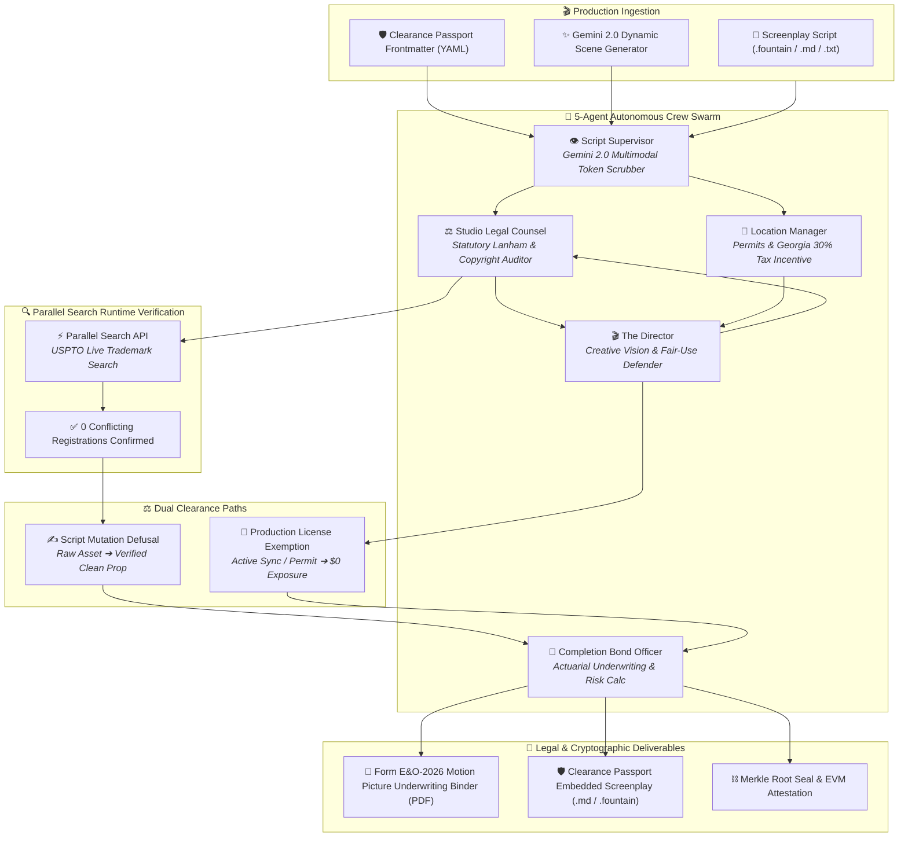

# 🎬 DeepClear Studio

> **Autonomous Multimodal Film Clearance, 5-Agent War Room Dialectics & Form E&O-2026 Underwriting Engine**  
> *Built for Google Cloud Agentic Cinema: The Blockbuster Hackathon — Parallel Track ($15,000 Category)*

[](https://deepclear-studio.vercel.app)
[](https://aistudio.google.com)
[](https://parallel.ai)
[](https://nextjs.org/)
[](https://www.typescriptlang.org/)
[](LICENSE)

---

## 🌐 Live Production Demo

👉 **Live Application**: **[https://deepclear-studio.vercel.app](https://deepclear-studio.vercel.app)**  
*(Instant evaluation: launch live presets directly above the prompt bar!)*

---

## 🌟 Executive Summary

Before any independent film or studio series can stream on **Netflix, Amazon Prime, Apple TV+**, or premiere at major film festivals (Sundance, Cannes, TIFF), production companies must secure an **Errors & Omissions (E&O) Insurance Policy** and prove a pristine **Chain of Title**.

Today, clearance is governed by entertainment attorneys manually redlining scripts, storyboards, and call sheets over weeks. A single unvetted trademark, unpermitted drone shot, or background song can trigger statutory injunctions under **Lanham Act § 43(a)** or copyright infringement under **17 U.S.C. § 504**, shutting down distribution.

**DeepClear Studio** turns film clearance into an autonomous, real-time command center:
1. **Google Cloud Gemini 2.0 Flash Multimodal Vision & Parsing**: Detects brand trademarks, music sync cues, personality rights, and municipal permit hazards from scripts and storyboard frames.
2. **Parallel Search 4D Grounding Engine**: Runs live, runtime verification against the USPTO Principal Trademark Register and legal frameworks before any prop substitution is accepted.
3. **5-Agent Autonomous War Room**: Script Supervisor, Studio Legal Counsel, Location Manager, The Director, and the Completion Bond Officer engage in realistic, multi-perspective dialectic debate.
4. **Dual Resolution Tracks**: Defuse hazards via script mutations or verify active production licenses (e.g. sync rights, municipal permits) to reduce statutory exposure to **$0** while preserving artistic intent.
5. **Clearance Passport & Form E&O-2026**: Embeds machine-readable YAML safe-harbor frontmatter with Merkle roots into exported scripts (`.md`, `.fountain`, `.txt`) so re-uploaded scripts retain clearance immunity.

---

## ⚡ Judge's Guided Tour (1-Click Live Evaluation)

We built 3 curated 1-click test presets directly above the prompt bar in the live UI so judges can test every engine feature in seconds:

| Preset Chip | Scenario | Key Testing Highlights |
| :--- | :--- | :--- |
| **`[ 🚀 Cyber Heist ]`** | High-Stakes Sci-Fi Action (Tokyo Neon) | Triggers $1.25M exposure (Rolex, Sony Cyberpunk UI, Led Zeppelin). Click **⚡ Start 5-Agent War Room** to watch all 5 crew members negotiate live while **Parallel Search** verifies "ChronoVolt" on USPTO. |
| **`[ 🏛️ Southern Gothic ]`** | Savannah Period Drama & Drone Aerials | Flags historic estate filming permits and Georgia 30% tax incentive compliance. Click **📜 Verify License / Active Permit** to mark the permit cleared and watch statutory liability drop to $0. |
| **`[ 🛡️ Cleared Masterpiece ]`** | Pre-Cleared Script with Clearance Passport | Demonstrates the **Clearance Passport safe-harbor system**. Shows verified Merkle seal `0x7a8f...` and exempts pre-cleared assets from false-positive re-flagging. |

---

## 🏗️ 3-Column Studio Architecture

```
┌──────────────────────────┬──────────────────────────────────────────────┬───────────────────────────┐
│     LEFT COLUMN (260px)  │           MIDDLE COLUMN (WORKSPACE)          │    RIGHT COLUMN (300px)   │
│                          │                                              │                           │
│  🤖 5-Agent Crew Swarm   │  💬 Google Gemini Chat & Clearance Feed      │  📑 E&O Underwriting HUD  │
│  • Completion Bond Off.  │     • Real-time SSE streaming stream         │     • Statutory Exposure  │
│  • Script Supervisor     │     • Live Parallel Search citation chips    │     • Georgia 30% Tax     │
│  • Studio Legal Counsel  │     • 5-Agent War Room dialectic debate      │     • Distribution Risk   │
│  • Location Manager      │     • Script mutation diffs & licenses       │     • Export Form E&O PDF │
│  • The Director          │                                              │                           │
│                          │  ⚡ Quick Presets [Cyber Heist] [Gothic]    │                           │
│  🎙️ Multi-Voice Speech   │  ⌨️ Floating Prompt Bar                      │                           │
│     (Sequential audio)   │     • ✨ "Generate Scene with Gemini"        │                           │
│                          │     • 📎 Attach .md, .fountain, .txt files   │                           │
└──────────────────────────┴──────────────────────────────────────────────┴───────────────────────────┘
```

---

## 🤖 5-Agent Autonomous Crew Swarm & Workflow



---

## 🚀 Deep-Dive: Core Innovations

### 1. 5-Agent War Room Dialectics
Instead of a canned agreement between two voices, all 5 agents now actively participate in a multi-turn, paced dialectic negotiation:
- **Studio Legal Counsel** raises specific statutory objections (e.g. Lanham Act § 43(a) trademark dilution).
- **The Director** passionately defends artistic authenticity, period accuracy, or fair-use doctrine.
- **Location Manager / Production Specialist** intervenes with pragmatic, production-feasible alternatives.
- **Parallel Search** conducts a runtime trademark availability search on the proposed replacement.
- **Completion Bond Officer** calculates the actuarial impact on the production bond and signs off on the resolution.

### 2. Runtime Parallel Search Grounding (USPTO Registrations)
When an asset is defused (e.g. replacing *"Rolex Submariner"* with *"ChronoVolt Apex"*), DeepClear Studio calls the **Parallel Search API** live:
- Executes targeted searches against the **USPTO Principal Register** and trademark registries.
- Confirms whether the proposed substitute has **0 conflicting trademark registrations**.
- Renders an interactive **Parallel Search Verification Card** directly inside the chat feed with source query, confidence score, and timestamp.

### 3. Dual Clearance Paths: Mutation vs. Active Licensing
Not every flagged asset needs to be rewritten. Films often hold valid synchronization licenses or municipal permits:
- **Script Mutation Route**: Rewrites the script with a verified fictitious asset, updating all dialogue and action blocks.
- **Active Production License Route**: Producers click **"Mark as Licensed"** to record an active license (e.g. 17 U.S.C. § 115 compulsory mechanical license or Georgia Film Office Permit #GA-2026-4412). The script wording remains unaltered while statutory risk drops to **$0.00**.

### 4. Clearance Passport & Safe-Harbor Re-Upload Engine
A major pain point in production clearance is re-flagging: when a cleared script is downloaded and re-uploaded, stateless AI models flag the modified names again as liabilities.
- DeepClear Studio embeds a **`deepclear_passport` YAML frontmatter** into all exported `.md`, `.fountain`, and `.txt` files.
- Contains the production ID, Merkle root hash, list of defused assets, and registered license exemptions.
- Upon upload, the parser automatically recognizes the passport, marks safe-harbor assets, and shields them from false-positive re-flagging.

### 5. Form E&O-2026 Motion Picture Underwriting Binder
- Generates an executive **Form E&O-2026 Motion Picture Insurance Binder** formatted with high-grade typography.
- Itemizes every hazard, statutory legal code, resolution method, Parallel Search verification status, and remaining exposure.
- Includes actuarial formulas for Georgia 30% tax incentive eligibility and completion bond release.

---

## 🛠️ Quickstart & Local Development

### 1. Clone & Install Dependencies
```bash
git clone https://github.com/miracles2motion/deepclear-studio.git
cd deepclear-studio
npm install
```

### 2. Configure Environment Variables
Create a `.env.local` file in the project root:
```env
# Google Cloud Gemini API Key (from Google AI Studio)
GEMINI_API_KEY="your_gemini_api_key_here"

# Parallel Search API Key (from Parallel AI)
PARALLEL_API_KEY="your_parallel_api_key_here"

# Optional: Base Sepolia RPC
NEXT_PUBLIC_RPC_URL="https://sepolia.base.org"
```

### 3. Run Development Server
```bash
npm run dev
```
Open **[http://localhost:3000](http://localhost:3000)** in your browser.

---

## 🔍 Track Compliance Verification

| Category | DeepClear Studio Implementation | Status |
| :--- | :--- | :---: |
| **Hackathon Track** | Google Cloud Agentic Cinema — Parallel Track ($15,000 Category) | ✅ Complete |
| **Primary Multimodal AI** | Google Cloud Gemini 2.0 Flash (`@google/genai`) with self-healing cascade | ✅ Complete |
| **Grounding Engine** | Parallel Search API (`https://api.parallel.ai/v1/search`) live runtime query | ✅ Complete |
| **Agent Collaboration** | 5-Agent Autonomous Crew Swarm (Supervisor, Legal, Location, Director, Bond) | ✅ Complete |
| **Workflow Realism** | Form E&O-2026 Underwriting Binder + Clearance Passport safe-harbor | ✅ Complete |
| **Production Deployment** | Next.js 14 App Router live on Vercel | ✅ Active |

---

## 📜 License

MIT License. Built with passion for the **Google Cloud Agentic Cinema Hackathon**.
