# 🎬 DeepClear Studio

> **Autonomous Multimodal Film Clearance, Crew-Agent Dialectic Negotiation & E&O Underwriting Engine**  
> *Built for Google Cloud Agentic Cinema Hackathon — Parallel Track ($15,000 Category)*

[](https://deepclear-studio.vercel.app)
[](https://cloud.google.com/vertex-ai)
[](https://parallel.ai)
[](https://nextjs.org/)
[](LICENSE)

---

## 🌟 Executive Summary

In cinematic production, the creative vision of filmmakers constantly collides with legal liability, clearance bottlenecks, and insurance rejection. Before any film or series can stream on **Netflix, Amazon Prime, Apple TV+**, or premiere at major film festivals, production companies must secure an **Errors & Omissions (E&O) Insurance Policy** and verify a pristine **Chain of Title**.

Today, this clearance process is governed by entertainment attorneys who manually review scripts, storyboards, and set designs. A single unvetted brand logo, unpermitted drone shot, or background artwork can trigger costly copyright injunctions and delay distribution.

**DeepClear Studio** automates this clearance pipeline into a real-time, multi-agent command center powered by Google Cloud Gemini and Parallel Search.

---

## 🏗️ Multi-Agent Swarm Architecture

```mermaid
flowchart TD
    subgraph Inputs["🎬 Production Inputs"]
        SC["📄 Screenplay Script (.fountain / text)"]
        SB["🖼️ Storyboard Visual Frames"]
    end

    subgraph Swarm["🤖 5-Persona Autonomous Crew Swarm"]
        SS["👁️ Script Supervisor<br/><i>Gemini 2.0 Multimodal Vision</i>"]
        LC["⚖️ Studio Legal Counsel<br/><i>Parallel 4D Search Grounding</i>"]
        LM["📍 Location Manager<br/><i>Permits & Tax Rebate Arbitrage</i>"]
        DIR["🎬 The Director<br/><i>Adversarial Fair-Use Defender</i>"]
        CBO["👑 Completion Bond Officer<br/><i>Actuarial Risk & Underwriting</i>"]
    end

    subgraph Engine["⚡ Live War Room Engine"]
        WAR["🎙️ Audible Dialectic War Room<br/><i>Dual-Voice TTS Debate</i>"]
        MUT["✍️ Live Script Mutation<br/><i>Strike-through & Emerald Compromise</i>"]
        SWP["🎨 Safe-Prop Swapper<br/><i>Bounding Box & Defusal Slider</i>"]
    end

    subgraph Outputs["📜 Cryptographic & Legal Deliverables"]
        PDF["📑 Form E&O-2026 Insurance Binder (jsPDF)"]
        W3["⛓️ On-Chain Clearance Passport (EVM SHA-256)"]
        HD["📰 Trade Impact Simulation"]
    end

    Inputs --> SS
    SS --> LC & LM
    LC & LM --> DIR
    DIR <-->|Dialectic Conflict| LC
    DIR & LC --> WAR
    WAR --> MUT & SWP
    MUT & SWP --> CBO
    CBO --> PDF & W3 & HD

    style CBO fill:#1e1b4b,stroke:#818cf8,stroke-width:2px
    style LC fill:#1e293b,stroke:#38bdf8,stroke-width:2px
    style DIR fill:#31101e,stroke:#f43f5e,stroke-width:2px
    style SS fill:#064e3b,stroke:#34d399,stroke-width:2px
    style LM fill:#3b1a04,stroke:#fb923c,stroke-width:2px
```



---

## ⚡ Key Features

### 1. 👁️ Multimodal Storyboard Defusal & Safe-Prop Swapper
Scans storyboard frames with Gemini Multimodal to detect visible trademarks, copyrighted artwork, and unpermitted architecture with precision bounding boxes. Generates instant legal substitutions with an interactive **Before/After slider**:

| Original Hazarded Frame | Agent-Negotiated Defusal | Legal Status |
|---|---|---|
| Character drinks from a **"Red Bull"** can on camera | Swapped to fictional **"VoltRush Energy"** prop | 🟢 **CLEARED (0% Infringement)** |
| Background artwork resembles copyrighted mural | Swapped to original generated artwork | 🟢 **CLEARED (Case law precedent avoided)** |

### 2. 🌐 4-Dimensional Parallel Grounding Matrix
Queries live external databases across four critical vectors using the **Parallel Search API**:
- **USPTO Trademark Registry:** Live serial number lookups and brand protection status.
- **Municipal Permitting Ordinances:** LAPD FilmLA, NYPD, and FAA Part 107 drone regulations.
- **Federal Case Law Precedents:** Direct legal citations (*Hangover II*, *12 Monkeys*, *Campbell v. Acuff-Rose*).
- **State Tax Rebate Arbitrage:** Real-time production incentive calculations (e.g., Georgia 30% vs California 0%).

### 3. 🎙️ Audible Dialectic War Room & Live Script Mutation
Simulates real-time verbal debates between the **Director** (arguing artistic intent) and **Legal Counsel** (arguing statutory compliance) using dual-voice synthesis:
```
[DIRECTOR]: "The character slamming a branded energy drink is vital to his persona! It's Fair Use!"
[COUNSEL]:  "Under 15 U.S.C. § 1125, trademark owners routinely sue for product tarnishment. We must defuse."
[MUTATION]: "He chugs a [~~can of Red Bull~~] [VoltRush Energy can] and hammers the keyboard."
```
The screenplay text physically animates on screen with red strike-throughs and emerald-green typed compromises.

### 4. 📰 Production Liability & Trade Impact Simulation
Visualizes the financial consequence of clearance decisions with a dynamic trade headline indicator:
- 🔴 **High Liability State:** `"VARIETY: Production Halted by Injunction; $4.2M Exposure Over Unvetted Trademark"`
- 🟢 **Post-Clearance State:** `"DEADLINE: Streamer Bidding War Erupts; 100% Cleared E&O Binder Expedites Release"`

### 5. ⛓️ Form E&O-2026 Binder & Cryptographic Clearance Passport
- **1-Click Underwriting PDF:** Generates a formal 4-page Errors & Omissions policy application with full chain-of-title logs and QR code.
- **On-Chain Audit Trail:** Mints an immutable SHA-256 clearance certificate to Base Sepolia testnet.

---

## 🎯 1-Click Evaluation Tour

We provide 3 preset scenarios in the top control bar for instant testing:

```
┌─────────────────────────────────────────────────────────────────────────────┐
│ 🎬 PRESET 1: "Sci-Fi Cyberpunk Script"    → 🔴 High Risk ($2.8M Exposure)   │
│ 🎬 PRESET 2: "Historical Drama Benchmark" → 🟡 Moderate Risk ($420k Exp)   │
│ 🎬 PRESET 3: "Fully Cleared Production"   → 🟢 Zero Liability (0% Risk)     │
└─────────────────────────────────────────────────────────────────────────────┘
```

<details>
<summary><b>🔍 Step-by-Step Test Walkthrough (Click to Expand)</b></summary>

1. **Load Scenario:** Select a preset scenario from the top navigation bar.
2. **Execute Multimodal Scan:** Observe the 5-agent swarm illuminate with live telemetry links.
3. **Inspect Parallel Grounding:** Review citations retrieved from USPTO and case law via Parallel Search.
4. **Listen to Audible War Room:** Hear the Director and Legal Counsel debate the script compromise.
5. **Watch Script Mutation:** Witness the red strike-through and real-time typed replacement text.
6. **Defuse Visual Props:** Drag the Before/After slider on the storyboard canvas.
7. **Export Deliverables:** Download the **Form E&O-2026 PDF Binder** and view the **On-Chain Passport**.
</details>

---

## 🏆 Hackathon Track Compliance

| Requirement | Implementation | Status |
|---|---|---|
| **Google Cloud AI at Runtime** | `@google/genai` (Gemini 2.0 Flash for Multimodal Vision, Reasoning, and Debate) | ✅ Active Runtime Usage |
| **Parallel Search API at Runtime** | `parallel-web` SDK querying Trademark, Municipal, Case Law, and Tax databases | ✅ Active Runtime Usage |
| **Open Source License** | Permissive MIT License in root repository | ✅ MIT Detectable |
| **Platform Target** | Responsive Web App built with Next.js 14, Tailwind CSS, Framer Motion | ✅ Web App |
| **Model Restriction** | 100% powered by Google Cloud Gemini + Parallel Search (Zero third-party AI APIs) | ✅ Fully Compliant |

---

## 🛠️ Tech Stack & Directory Structure

```
deepclear-studio/
├── app/                  # Next.js 14 App Router
│   ├── api/analyze/      # SSE Multimodal Swarm Extraction
│   ├── api/debate/       # Agent Dialectic Debate Stream
│   └── api/defuse-prop/  # Storyboard Safe-Prop Substitution
├── components/           # War Room UI
│   ├── AgentNetworkGraph # 5-Node Swarm with Live Telemetry
│   ├── ScriptViewer      # Dynamic Strike-Through & Mutation
│   ├── StoryboardViewer  # Multimodal Bounding Box & Slider
│   ├── DynamicHUD        # Actuarial Gauge & Trade Impact Card
│   └── AudibleWarRoom    # Dual-Voice Web Speech Synthesizer
├── lib/
│   ├── gemini.ts         # Google GenAI SDK Client
│   ├── parallel.ts       # Parallel Search 4D Grounding Client
│   ├── web3.ts           # EVM SHA-256 Testnet Minting
│   └── pdfGenerator.ts   # Form E&O-2026 jsPDF Binder Engine
└── logs/
    └── CHANGELOG.md      # Development & Bug Audit Trail
```

---

## ⚡ Quickstart Guide

### 1. Clone & Install
```bash
git clone https://github.com/miracles2motion/deepclear-studio.git
cd deepclear-studio
npm install
```

### 2. Configure Environment Keys
Create a `.env.local` file in the root directory:
```env
# Google Gemini API Key (from https://aistudio.google.com)
GEMINI_API_KEY=your_gemini_api_key_here

# Parallel Search API Key (from https://parallel.ai)
PARALLEL_API_KEY=your_parallel_api_key_here

# Optional: Web3 RPC Provider (Base Sepolia / Polygon Amoy)
NEXT_PUBLIC_RPC_URL=https://sepolia.base.org
```

### 3. Run Locally
```bash
npm run dev
```
Open [http://localhost:3000](http://localhost:3000) to launch DeepClear Studio.

---

## 📜 License

Distributed under the **MIT License**. See [LICENSE](LICENSE) for more information.

---

<div align="center">
  <sub>DeepClear Studio — Google Cloud Agentic Cinema Hackathon (Parallel Track)</sub>
</div>
